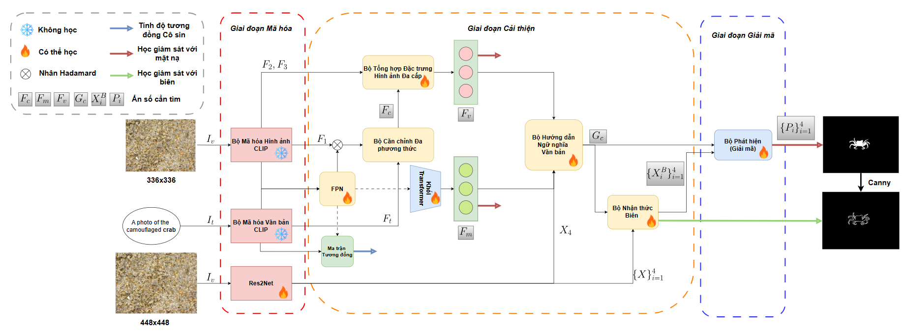
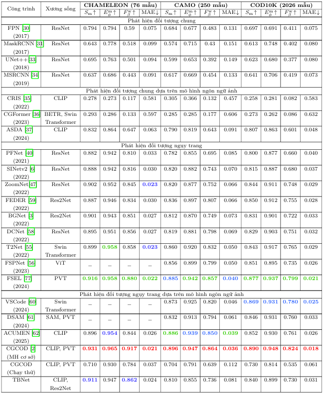
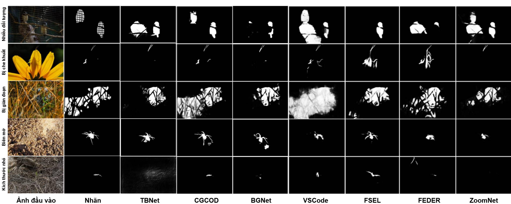

  #  Text and Boundary Network for Camouflaged Object Detection

> **Author:** 
> Truong Tran Phuong Khanh

  ## TBNet Overview

Inspired by early works that leverage boundary cues to enhance segmentation quality, and motivated by the recent success of **Vision–Language Models (VLMs)** in semantic object localization, we propose **TBNet (Text and Boundary Network)**.

TBNet is designed to address the challenge of accurately localizing camouflaged objects using high-level semantic guidance from VLMs, while simultaneously improving segmentation quality through effective exploitation of object boundary cues. To this end, the proposed model adopts a **parallel architecture** consisting of two complementary branches: a **text–image branch** that extracts semantic representations guided by a VLM, and a **boundary-aware visual branch** that focuses on capturing fine-grained image features with particular attention to object boundaries.

The features extracted from these two branches are progressively integrated through multiple **Multi-Head Cross-Attention (MHCA)** layers, which facilitate effective cross-modal interaction by emphasizing informative cues while suppressing irrelevant or noisy features, thereby enabling more accurate and robust segmentation of camouflaged objects.

    
    <em>
    Overall architecture of the proposed TBNet. The model consists of a visual–textual branch and a visual–boundary branch.
    </em>

## CAMOClass Dataset

The model is trained on the CAMOClass dataset, which is organized following the folder structure adopted in [CGCOD](https://arxiv.org/pdf/2412.18977). Specifically, CAMOClass is constructed from the COD10K-Train and CAMO++-Train subsets, where images are grouped into class-specific folders corresponding to different camouflaged object categories. Each folder contains images featuring the associated camouflaged object class.

    dataset
        --train
            --Imgs
                --Ant
                --Bat
                ...
            --GT
                --Ant
                --Bat
                ...
        --test
            --CAMO
                --Imgs
                --GT
            --COD10K
                --Imgs
                --GT
            --CHAMELEON
                --Imgs
                --GT

To facilitate semantic learning, the prompts used for CLIP training incorporate a dynamic class token derived from the folder name of each image. This design enables the model to effectively exploit class-level semantic information and enhances its ability to distinguish camouflaged objects based on textual guidance.

The prompt templates used for both training and evaluation are selected based on the prompt effectiveness analysis reported in [OVCAMO](https://arxiv.org/pdf/2311.11241). As shown in their comparative study, CLIP demonstrates strong performance in camouflaged object classification when guided by the simple yet effective prompt **“a photo of the camouflaged \<class>”**, which is therefore adopted as the default prompt during the training of TBNet.

During the testing phase, we further simplify the textual input by using a class-agnostic prompt, “a photo of the camouflaged object”, without observing any noticeable degradation in performance. This indicates that TBNet primarily relies on the learned visual–semantic alignment during training, while maintaining robustness to generic textual descriptions at inference time.

## Experiments

The experiments for training TBNet were conducted under the following settings:

- Backbone: 
    - CLIP@ViT-B/14 pretrained by OpenAI
    - Res2Net50 pretrained with ImageNet

- Framework: Pytorch.

- Python: >= 3.10

- Environment: Kaggle

- Hardware: NVIDIA GPU

- Epochs: 200

- Learning rate: $5 \times 10^{-5}$

- Batch size: 4

In addition, we evaluated and collected results from 20 representative methods for the camouflaged object detection (COD) task. TBNet achieves Top-3 performance on the CHAMELEON dataset, while its performance slightly decreases on the remaining two datasets, COD10K and CAMO.

    
    <em>
    Results of camouflaged object detection models from 2021 to 2025. The reported results are collected from published papers, while additional results are obtained through our own inference.
    </em>

In practice, the segmentation results of TBNet exhibit more stable and coherent segmented regions compared to other models, even when achieving higher accuracy. However, the model still tends to misclassify regions adjacent to camouflaged objects, indicating remaining challenges in precisely distinguishing object boundaries from surrounding background.

    
    <em>
    Segmentation maps produced by camouflaged object detection methods.
    </em>

## Environment Settings

Before running the code, please install 

## Training

For the training process, run:

    python train.py --config 'config/TBNet.yaml'

## Testing

Puth the pretrained backbone [here](https://drive.google.com/drive/folders/13djzd6dCaLzdKjPP9FGjFpSEhzOkQ5xU?usp=sharing).

    --pretrain
        res2net50_v1b_26w_4s-3cf99910.pth
        ViT-L-14-336px.pt

Put the pretrained checkpoint [here](https://drive.google.com/drive/folders/12t6rQWtBo5DIZA-dm5rqwbT_Vntc3vd5?usp=sharing).

    --exp
        --metapara_noattr_3_1_50
            TBNet.pth
And run:

    python test.py --config config/TBNet.yaml

This repository supports three additional methods (ACUMEN, BGNet, and SINetv1).
To evaluate a specific method, place its checkpoint in `./exp/metapara_noattr_3_1_50` and run:

(P.S. Checkpoints are available via the links in the Related Works section below.)

    python test.py --config config/SINet.yaml

## Related Works

Thanks the authors of previous works for providing code implementations that facilitated this project.

[1] [Unlocking Attributes' Contribution to Successful Camouflage: A Combined Textual and Visual Analysis Strategy](https://github.com/lyu-yx/ACUMEN), ECCV 2024.

[2] [CGCOD: Class-Guided Camouflaged Object Detection](https://github.com/bbdjj/CGCOD), ACMMM2025.

[3] [Boundary-Guided Camouflaged Object Detection](https://github.com/thograce/BGNet), IJCAI 2022.

[4] [Camouflaged Object Detection](https://github.com/DengPingFan/SINet), CVPR2020